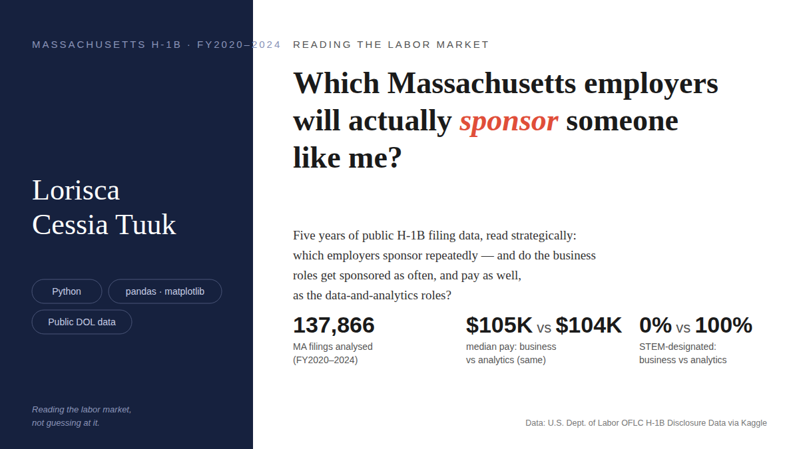
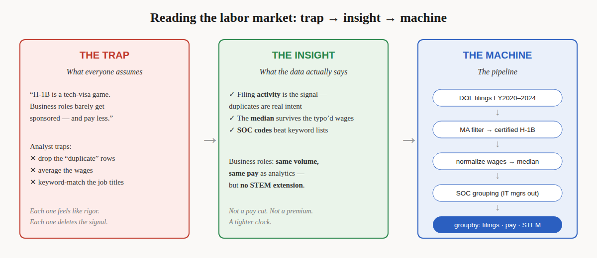

# Reading the Massachusetts labor market through H-1B filings

🎥 **[H-1B Massachusetts FY2020-2024 Analysis](https://www.youtube.com/watch?v=SEite--Lkh4)** — a 10-minute walkthrough of the code and every judgment call in it.

I'm an international job seeker on an F-1 visa. Finding the right role isn't the whole job search — I also need an employer who'll go the full distance: OPT → STEM OPT → H-1B. So I read five years of public H-1B filing data (FY2020–2024, Massachusetts) and asked a strategic question: do the general-business roles I'd apply to (HR, talent, consulting, project management, operations) get sponsored as often, and pay as well, as the data-and-analytics roles my visa plan leans on?

**The answer:** business roles — 13,672 certified filings, $105,000 median pay. Analytics roles — 14,035 filings, $104,000 median. A statistical check says those two medians are effectively the same. Moving toward the business roles isn't a pay cut. The catch: 0% of the business roles count as STEM, against 100% of the analytics roles — so the H-1B clock is tighter on the business side.

**A correction I owe you.** An earlier version of this analysis reported the business median as $115,000. That number was thrown off: 2,583 IT managers (median pay $167,502) had slipped into the business group through their occupation code. I re-ran it without them. $105,000 is the honest number, and the notebook shows exactly what changed.



## The story in STAR form

**Situation.** An F-1 visa holder with a STEM-eligible analytics background, job hunting with a visa clock running. The question isn't just "who's hiring" — it's "who sponsors, repeatedly."

**Task.** Compare general-business roles against data-and-analytics roles on three things: sponsorship volume, pay, and STEM designation — using 137,866 Massachusetts filings (FY2020–2024) from the U.S. Dept. of Labor disclosure data.

**Action.** Did the analysis in Python with four deliberate calls: kept duplicate filings as a signal of sponsor intent instead of deleting them; normalized every wage to annual and reported medians (typo'd pay units make averages meaningless here); grouped roles by government occupation codes instead of brittle keyword matching; and corrected the business group by excluding IT managers, matched by title because the same occupation is coded three different ways.

**Result.** 13,672 vs 14,035 filings. $105,000 vs $104,000 median pay — statistically the same. 0% vs 100% STEM. Business roles sponsor at the same rate and pay the same, with a tighter H-1B clock.

## How it works

1. **Load** the Massachusetts-filtered disclosure file (137,866 rows, 15 columns).
2. **Filter** to H-1B filings with Certified status (123,497 rows).
3. **Normalize** every offered wage to an annual figure; report medians throughout.
4. **Group** roles by SOC occupation code: families 11/13 → general business (minus IT managers), five analytics titles → data & analytics.
5. **Compare** with one groupby — filings, median wage, STEM share — plus bootstrap confidence intervals on the medians.

The code lives in [`src/h1b_ma.py`](src/h1b_ma.py) — one place, tested against the original analysis. The narrative, charts, and decision log are in [`notebooks/h1b_ma_analysis.ipynb`](notebooks/h1b_ma_analysis.ipynb). `requirements.txt` is pinned; the notebook runs top to bottom with `jupyter nbconvert --execute`.

## What this doesn't do

- A filing is **intent, not a hire** — it says who sponsors repeatedly, not who got hired.
- It says **nothing about OPT hiring**, the first rung of the ladder.
- Employer name variants (Wayfair appears three ways) mean the sponsor ranking **understates** some companies — quantified in the notebook, not hidden.
- FY2020–2024 includes the pandemic years; the floor (~21k filings/year) matters more than the peaks.

The full list lives in [`docs/limitations.md`](docs/limitations.md).

## Links

- **Data:** [H1B LCA Disclosure Data (2020–2024)](https://www.kaggle.com/datasets/zongaobian/h1b-lca-disclosure-data-2020-2024) — U.S. Dept. of Labor disclosure files via Kaggle. Rebuild steps in [`data/README.md`](data/README.md).
- **Walkthrough:** [H-1B Massachusetts FY2020-2024 Analysis](https://www.youtube.com/watch?v=SEite--Lkh4) — the code and the decisions, on video.
- **Notebook:** [`notebooks/h1b_ma_analysis.ipynb`](notebooks/h1b_ma_analysis.ipynb)

## Inside this repo

```
├── README.md                  # you are here
├── notebooks/
│   └── h1b_ma_analysis.ipynb  # the full analysis, finding first
├── src/
│   └── h1b_ma.py              # the code: load → filter → normalize → group → compare
├── docs/
│   ├── limitations.md         # everything this data can't say
│   ├── trap-insight-machine.svg / .png
├── visuals/
│   ├── hero.svg / hero.png      # title card
│   ├── top-employers.png
│   ├── yearly-volume.png
│   └── pay-comparison.png
├── data/
│   └── README.md              # where the data lives (CSV not checked into git)
├── requirements.txt
└── LICENSE (MIT)
```
